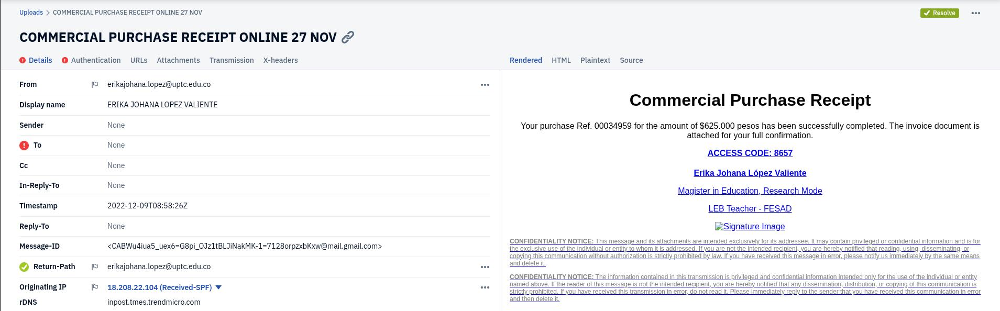

 # 🚨 Phishing Email Malware Campaign Analysis

### BitRAT / AsyncRAT Malware Delivery via Fake Commercial Receipt

## 📌 Overview

This repository documents the technical analysis of a **phishing email campaign delivering a malicious executable payload** disguised as a commercial purchase receipt.

The attack uses **social engineering combined with malware delivery infrastructure** to infect victims with **BitRAT / AsyncRAT remote access malware**.

The investigation covers:

* Email header forensics
* Authentication analysis (SPF / DKIM / DMARC)
* Malicious infrastructure discovery
* Malware threat intelligence correlation
* Sandbox behavioral analysis
* Indicators of Compromise (IOC)

---




# 🧾 Phishing Email

**Subject**

```
COMMERCIAL PURCHASE RECEIPT ONLINE 27 NOV
```

**Sender**

```
ERIKA JOHANA LOPEZ VALIENTE
erikajohana.lopez@uptc.edu.co
```

**Lure Message**

```
Your purchase Ref. 00034959 for the amount of $625.000 pesos has been successfully completed.
The invoice document is attached for confirmation.
```

**Malicious Download**

```
http://107.175.247.199/loader/install.exe
```

**Access Code**

```
8657
```

This message attempts to convince victims that a financial transaction occurred and encourages them to **download an invoice document**, which is actually malware.

---

# 📧 Email Authentication Analysis

| Mechanism | Result  | Meaning                      |
| --------- | ------- | ---------------------------- |
| SPF       | FAIL    | Sender IP not authorized     |
| DKIM      | NEUTRAL | Signature not validated      |
| DMARC     | FAIL    | Domain authentication failed |

This strongly indicates **email spoofing or unauthorized sending infrastructure**.

---

# 🌐 Malicious Infrastructure

### Malicious Host

```
107.175.247.199
```

### Malware Download Path

```
/loader/install.exe
```

Threat intelligence sources classify this host as **malware distribution infrastructure**.

Associated malware families:

```
BitRAT
AsyncRAT
CoinMiner
```

---

# 🧠 Threat Intelligence

URL reputation databases identify the infrastructure as:

**Threat Type**

```
Malware Distribution
```

**Campaign Tags**

```
AsyncRAT
BitRAT
CoinMiner
```

This suggests the infrastructure may be used for **multi-payload malware campaigns**.

---

# 🧪 Malware Analysis

### Sample Type

```
Executable (.exe)
```

### SHA256

```
bf76286895c2df7a3020034a065397592a1f8850e59f9a448b555bc1c8c639539
```

### Detection Rate

```
51 / 72 security vendors detected the sample as malicious
```

Common classifications:

```
Trojan
Downloader
Remote Access Trojan
Malware Loader
```

---

# 🔬 Sandbox Behavioral Analysis

Dynamic analysis reveals malicious behaviors including:

### Execution Chain

```
install.exe
 └── powershell.exe
      └── payload execution
```

### Observed Techniques

* PowerShell command execution
* Process injection
* Payload staging
* Persistence techniques
* System reconnaissance
* Network communication

The sample shows strong indicators of **RAT deployment behavior**.

---

# ⚔️ Attack Chain

```
Phishing Email
      ↓
Social Engineering (Fake Invoice)
      ↓
Victim Clicks Download Link
      ↓
install.exe Downloaded
      ↓
Malware Execution
      ↓
PowerShell Payload Execution
      ↓
BitRAT / AsyncRAT Infection
```

---

# 🎯 Indicators of Compromise

## IP Addresses

```
107.175.247.199
18.208.22.104
```

## Malicious URL

```
http://107.175.247.199/loader/install.exe
```

## File Hash

```
bf76286895c2df7a3020034a065397592a1f8850e59f9a448b555bc1c8c639539
```

---

# 🧬 MITRE ATT&CK Mapping

| Technique | Description       |
| --------- | ----------------- |
| T1566     | Phishing          |
| T1204     | User Execution    |
| T1059     | Command Execution |
| T1105     | Malware Download  |
| T1055     | Process Injection |
| T1053     | Persistence       |

---

# 📊 Security Impact

This campaign demonstrates how attackers combine:

* **phishing emails**
* **malicious infrastructure**
* **social engineering**
* **RAT malware**

to gain remote access to victim systems.

Organizations should deploy:

* email authentication enforcement
* attachment sandboxing
* malicious URL filtering
* endpoint detection systems

---

# ⚠️ Disclaimer

This repository is provided for **cybersecurity research and educational purposes only**.

The malware samples and infrastructure referenced here must **not be executed outside controlled analysis environments**.
